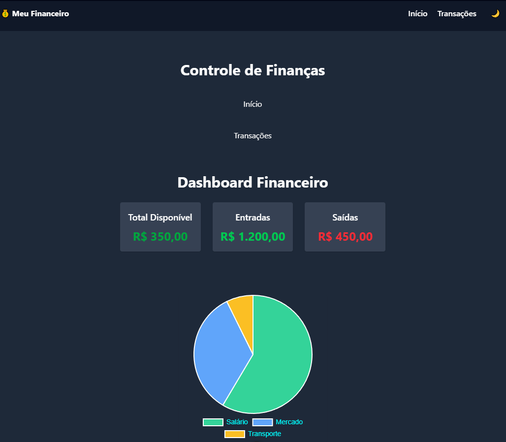

# 💰 Dashboard Financeiro Pessoal

Um aplicativo web simples para controle de finanças pessoais, desenvolvido com Vue.js 3, Pinia e Tailwind CSS.



## 🚀 Tecnologias

- [Vue 3](https://vuejs.org/)
- [Pinia](https://pinia.vuejs.org/)
- [Vue Router](https://router.vuejs.org/)
- [Tailwind CSS](https://tailwindcss.com/)
- [Chart.js](https://www.chartjs.org/)

## 📦 Instalação

```bash
git clone https://github.com/seu-usuario/dashboard-financeiro.git
cd dashboard-financeiro
npm install
npm run dev